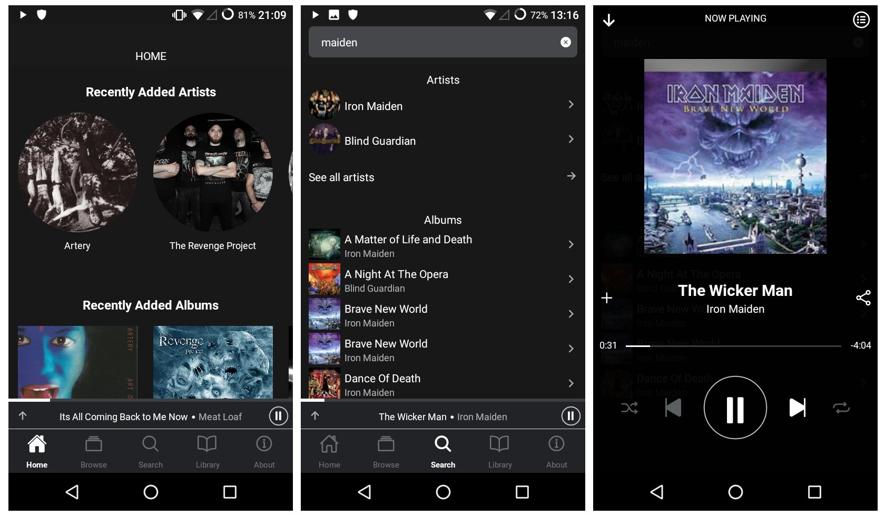

## Euterpe Mobile

This is the mobile client for the [Euterpe](https://listen-to-euterpe.eu) media server. It is written with react-native and could run on iOS and Android.



<!-- MarkdownTOC -->

* [Name](#name)
* [Project Status](#project-status)
* [Installation](#installation)
    - [Android](#android)
    - [iOS](#ios)

<!-- /MarkdownTOC -->

### Name

Note that currently the whole project is in the process of renaming from "HTTPMS" to "Euterpe". This might take some time as there is only one person behind all Euterpe-related. And that's me!

Keep that in mind and when you see "HTTPMS" somewhere, do know that we're talking about Euterpe still. I hope to remove all references to the old name soon. Unfortunately for the mobile apps this is a big deal. Up to now they were all released with the identifier `com.httpms`. This will change and instead `com.doycho.euterpe` will be used instead in the future.

### Project Status

The app is stable and usable but there are still some kinks which I want to iron out before cutting version 1.0.0. Namely, they are:

* Downloading media to the phone for offline use
* Generally better behaviour when there is no internet connection
* ~~Some buttons are really hard to press for some devices. This seems to be react-native bug which I haven't found a workaround yet~~

### Installation

The distribution methods are a little immature still but if you really want to want the mobile Euterpe app then you could have it!

#### Android

At the time of writing the only distribution method is [F-Droid](https://f-droid.org/). And I've created my own fdroid repository to make it even harder for you! Anyway, this is the process for installation:

* Install F-Droid on your Android if you haven't already
* Under "Settings" find "Repositories" and add `https://fdroid.doycho.com/fdroid/repo` as a new repository
* Refresh the repositories (by pulling down in the F-Droid app)
* Search for "httpms"

Or you could skip F-Droid entirely and download an .apk file from this repository's releases page.

Publishing into the Google Play store is scheduled for when the project renaming is completed.

Alternatively you could install it from source:

```
npx react-native run-android --release
```

For that to work you will have to generate your own keystore for signing Android apps and define `HTTPMS_MOBILE_RELEASE_STORE_FILE` and `HTTPMS_MOBILE_RELEASE_KEY_ALIAS` into your `gradle.properties`.

#### iOS

The app will happily run on iOS but at this time I am not distributing it through the App Store. Dealing with the developer hostility of Apple and the costs related are too much for me at this time. So your best bet is to install the app from source. If you go this route get yourself Apple developer key and then run the following in the project directory:

```
npx react-native run-ios --release
```
